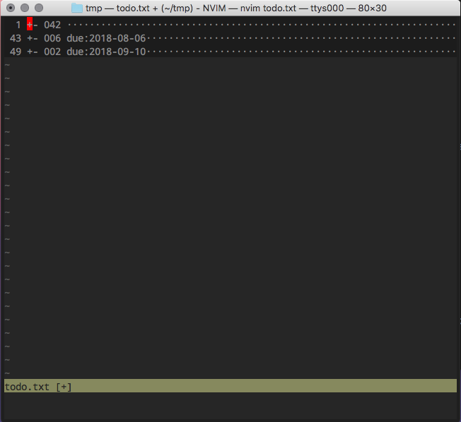

# vim-todoedit

vim-todoedit edits todo.txt with vim-partedit. It's useful to manage your tasks by folding with +folder, ++subfolder, due-date and @contexts.

## Images

sort and fold by due date
```
<Space> d
```



press `<Space> <Space>` on `+- 006 due:2018-08-06 ············` line.

```
<Space> <Space>
```

open another buffer, sort and fold by @Contexts

```
<Space> c
```

You can get just tasks for now.


## Thanks

    @thinca       vim-partedit
    @freitass     todo.txt-vim
    @dbeniamine   todo.txt-vim

## Requires

[vim-partedit](https://github.com/thinca/vim-partedit)

## Keymaps

sort and fold

| press key       | functions      |
| :-------------  | :------------- |
| \<localleader\>s  | previous sort  |
| \<localleader\>sf | +Folder        |
| \<localleader\>ss | ++SubFolder    |
| \<localleader\>sc | @Contexts      |
| \<localleader\>sd | due date       |
| \<localleader\>sx | completed task |

done and swipe

| press key       | functions           |
| :-------------  | :-------------      |
| \<localleader\>x  | toggle done tasks   |
| \<localleader\>X  | Swipe tasks         |

## More info

see: [doc/todoedit.txt](https://github.com/callmekohei/vim-todoedit/blob/master/doc/todoedit.txt)
