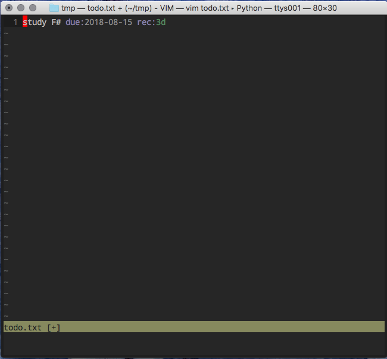

# vim-todoedit

vim-todoedit edits todo.txt with vim-partedit. It's useful to manage your tasks by folding with +folder, ++subfolder, due-date and @contexts.

## Images

create `todo.txt` file


write some tasks


sort and fold by due date

```
<Space> s d
```


press `<Space> <Space>` on `+- 006 due:2018-09-01 ············` line.

open another buffer

```
<Space> <Space>
```


sort and fold by @Contexts

You can get just tasks what you want.

```
<Space> s c
```


So you make a task done.


```
<Space> x
```


## Complition

needs :  
[deoplete.nvim](https://github.com/Shougo/deoplete.nvim)  
[deoplete-todoedit](https://github.com/callmekohei/deoplete-todoedit)  


## repeated tasks

Before done


After done



## Thanks

    @thinca       vim-partedit
    @freitass     todo.txt-vim
    @dbeniamine   todo.txt-vim

## Requires

[vim-partedit](https://github.com/thinca/vim-partedit)

## Keymaps

sort and fold

| press key       | functions      |
| :-------------  | :------------- |
| \<localleader\>s  | previous sort  |
| \<localleader\>sf | +Folder        |
| \<localleader\>ss | ++SubFolder    |
| \<localleader\>sc | @Contexts      |
| \<localleader\>sd | due date       |
| \<localleader\>sx | completed task |

done and swipe

| press key       | functions           |
| :-------------  | :-------------      |
| \<localleader\>x  | toggle done tasks   |
| \<localleader\>X  | Swipe tasks         |

## More info

see: [doc/todoedit.txt](https://github.com/callmekohei/vim-todoedit/blob/master/doc/todoedit.txt)
